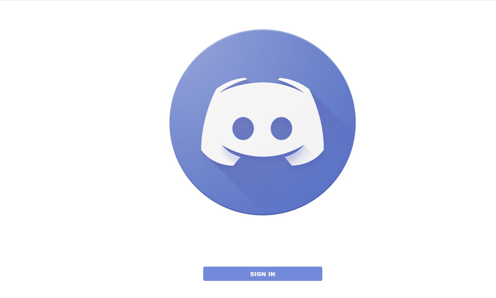
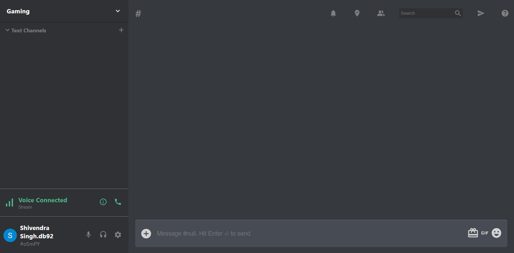

# Discord-clone-MERN

This project is a clone of Discord platform. You may visit the site by this link => [https://discord-clone-012.netlify.app](https://discord-clone-012.netlify.app/).

# Project Screenshots

# Login Page

 

# Home Page

# Note For Developers

### Technologies Used:

1. React JS
2. Node JS
3. MongoDB for database
4. Pusher
5. Netlify for deployment

You can run the below commands to see the project on your local system.

# Steps to run this project on your local machine:

Disclaimer: Use the package manager you have on your system. Run either: npm or yarn.

### Step - 1

Download the zip file from the above "Code" option, \
 or, \
Clone this repository by running the command "git clone https://github.com/shivendradb/Discord-clone-MERN.git" on the command prompt on your machine. \
Now, open the project directory using "cd Discord-clone-MERN" command.

### Step - 2

In the project directory, you will find 2 folders.

Navigate to "discord-backend" and run the command "npm install" on the command prompt to install the dependencies of the project on your local machine.

Run the server on the localhost by running "nodemon server.js" on the command prompt.

### Step - 3

Now, Navigate to "Discord-mern" and run the command "npm install" on the command prompt to install the dependencies of the project on your local machine.

Run the project on the localhost by running "npm start" on the command prompt.

Great!! 😃 You are done with setting up the project. 🚀

Now, open [http://localhost:3000](http://localhost:3000) to view it in your browser.

The page will reload if you make edits.\
You will also see any lint errors in the console.
